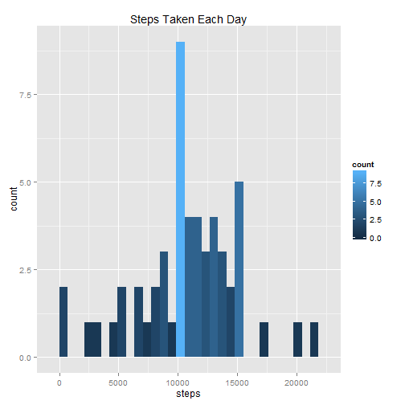
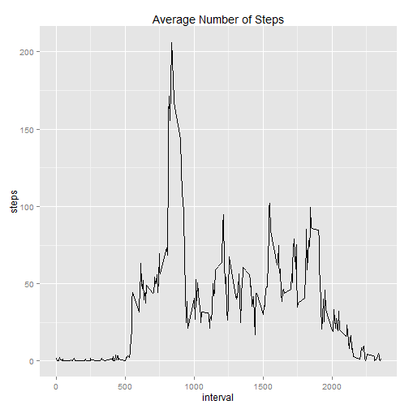
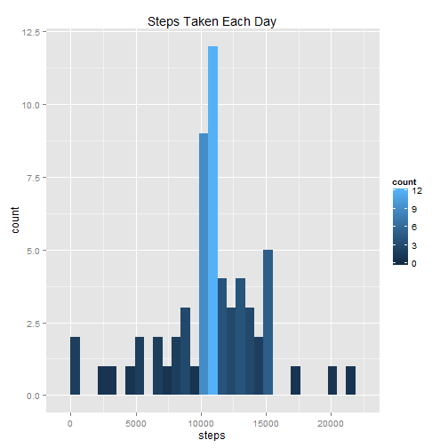
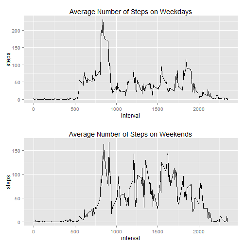

## Library used

```r
library(ggplot2)
library(gridExtra)
```

## Loading and preprocessing the data

```r
data <- read.csv("data/activity.csv", header=TRUE)
data$date <- as.Date(data$date)
```


## What is mean total number of steps taken per day?

1. Calculate the total number of steps taken per day

```r
stepsPerDay <- tapply(data$steps, data$date, sum)
```

2. Make a histogram of the total number of steps taken each day

```r
m <- qplot(stepsPerDay, geom="histogram", main="Steps Taken Each Day", 
           xlab="steps", ylab="count")
m + geom_histogram(aes(fill = ..count..))
```

 

3. Calculate and report the mean and median of the total number of steps taken 
per day

```r
meanSteps <- mean(stepsPerDay, na.rm=TRUE)
medianSteps <- median(stepsPerDay, na.rm=TRUE)
```
The mean is 1.0766189 &times; 10<sup>4</sup>. The median is 10765.


## What is the average daily activity pattern?

1. Make a time series plot (i.e. `type = "l"`) of the 5-minute interval (x-axis)
and the average number of steps taken, averaged across all days (y-axis)

```r
stepsPerInterval <- tapply(data$steps, data$interval, mean, na.rm = TRUE)
qplot(x=as.integer(names(stepsPerInterval)), y=stepsPerInterval, geom = "line", 
      main="Average Number of Steps",xlab="interval", ylab="steps") 
```

 

2. Which 5-minute interval, on average across all the days in the dataset, 
contains the maximum number of steps?

```r
intervalWithMaxStep <- names(which.max(stepsPerInterval))
```
The 5-minute interval that contains the maximum number of steps is 
835.


## Imputing missing values

Note that there are a number of days/intervals where there are missing values 
(coded as `NA`). The presence of missing days may introduce bias into some 
calculations or summaries of the data.

1. Calculate and report the total number of missing values in the dataset (i.e. 
the total number of rows with `NAs`)

```r
naNums <- sum(is.na(data))
```
The total number of missing values is 2304.

2. Devise a strategy for filling in all of the missing values in the dataset. 
The strategy does not need to be sophisticated. For example, you could use the 
mean/median for that day, or the mean for that 5-minute interval, etc.
Use mean of the interval to fill in the missing values.

3. Create a new dataset that is equal to the original dataset but with the 
missing data filled in.

```r
data$steps[is.na(data$steps)] <-
  stepsPerInterval[as.character(data$interval[is.na(data$steps)])]
```

4. Make a histogram of the total number of steps taken each day and Calculate 
and report the mean and median total number of steps taken per day. Do these 
values differ from the estimates from the first part of the assignment? What is 
the impact of imputing missing data on the estimates of the total daily number 
of steps?

```r
stepsPerDay <- tapply(data$steps, data$date, sum)

m <- qplot(stepsPerDay, geom="histogram", main="Steps Taken Each Day", 
           xlab="steps", ylab="count")
m + geom_histogram(aes(fill = ..count..))
```

```
## stat_bin: binwidth defaulted to range/30. Use 'binwidth = x' to adjust this.
## stat_bin: binwidth defaulted to range/30. Use 'binwidth = x' to adjust this.
```

 

```r
meanSteps <- mean(stepsPerDay, na.rm=TRUE)
medianSteps <- median(stepsPerDay, na.rm=TRUE)
```
The mean is 1.0766189 &times; 10<sup>4</sup>. The median is 1.0766189 &times; 10<sup>4</sup>. These values differ 
from the estimates from the first part of the assignment. The median is bigger 
than before.


## Are there differences in activity patterns between weekdays and weekends?

For this part the `weekdays()` function may be of some help here. Use the 
dataset with the filled-in missing values for this part.

1. Create a new factor variable in the dataset with two levels – “weekday” and 
“weekend” indicating whether a given date is a weekday or weekend day.

```r
weekend <- weekdays(data$date) == "Saturday" | weekdays(data$date) == "Sunday"
weekday <- !weekend
data$weekend <- weekend
data$weekday <- weekday
```

2. Make a panel plot containing a time series plot (i.e. `type = "l"`) of the 
5-minute interval (x-axis) and the average number of steps taken, averaged 
across all weekday days or weekend days (y-axis). See the README file in the 
GitHub repository to see an example of what this plot should look like using 
simulated data.

```r
dataAtWeekdays <- subset(data, data$weekday==TRUE)
stepsAtWeekdays <- tapply(dataAtWeekdays$steps, dataAtWeekdays$interval, mean, 
                          na.rm = TRUE)
p1 <- qplot(x=as.integer(names(stepsAtWeekdays)), y=stepsAtWeekdays, 
            geom = "line", main="Average Number of Steps on Weekdays", 
            xlab="interval", ylab="steps")

dataAtWeekends <- subset(data, data$weekend==TRUE)
stepsAtWeekends <- tapply(dataAtWeekends$steps, dataAtWeekends$interval, mean, 
                          na.rm = TRUE)
p2 <- qplot(x=as.integer(names(stepsAtWeekends)), y=stepsAtWeekends, 
            geom = "line", main="Average Number of Steps on Weekends", 
            xlab="interval", ylab="steps")

grid.arrange(p1, p2, ncol=1)
```

 


